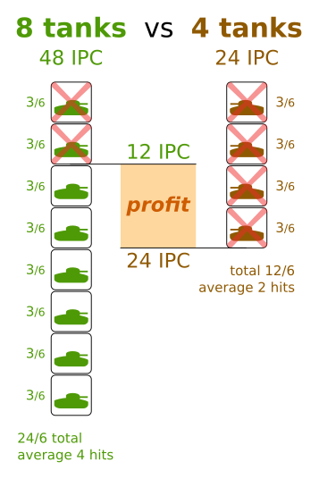
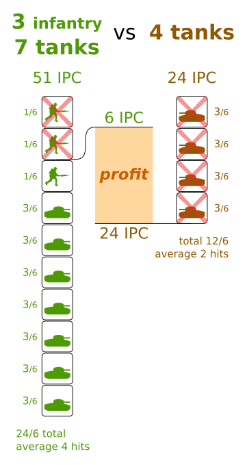

= How to win Axis and Allies 1940 (2th edition)
:awestruct-game_id: axisAndAllies1940
:awestruct-layout: boardGameBase

Let's take a look how you can win Axis and Allies (Europe, Pacific, Global) 2th edition.

== Attack with a larger army

Attack with an overwhelming army, not just to win the battle,
but to minimize your IPC loss.
For example let's presume your 8 tanks are attacking 4 tanks:

Your 8 tanks cause on average 4 hits in the first round,
killing all 4 tanks of the opposition.
But those 4 tanks only have 2 hits on average.
So in the end, you loose 2 tanks less than the opponent.
Given that each tank costs 6 IPC to build,
this gives you a profit of 12 IPC,
near the frontline (right where you want them).

So always attack with a larger army.
Don't pass up the opportunity to attack
a large force with a much larger force,
unless a counterattack is immanent.

== Bring cannon fodder

Cannon fodder are cheap units that are used to take hits,
so the more powerful, expensive units live longer.
There are 4 units that are considered cannon fodder:

* Infantry (3 IPC): the best on land
* Mechanized infantry (4 IPC): to resupply your army faster
* Submarine (6 IPC): the best on sea
* Destroyer (8 IPC): in case the enemy has airplanes and no destroyers, he can't hit the submarines

Always bring cannon fodder to minimize your IPC loss.
For example, let's presume your 3 infantry and 7 tanks attack 4 tanks:

Notice that for a mere loss of 6 IPC, the enemy lost 24 IPC,
which is a profit of 18 IPC, worth 75% of the enemy's entire army.

=== Supply lines matter: keep producing and sending cannon fodder

If you play it right, your expensive units won't die:
either you avoid conflict or you win battles and only/mainly your cannon fodder dies.
In the latter case, you'll need to replace those units.

Make sure the replacements arrive in time,
especially if the frontline is far away from your major production facilities.

== It's a long way from Berlin to Moscow

TODO

== Don't get attacked by a larger army

TODO

== Protect your transports

TODO

=== Capture those islands

TODO

== Convoys

TODO

== Secure the income of pro-enemy neutrals

TODO

