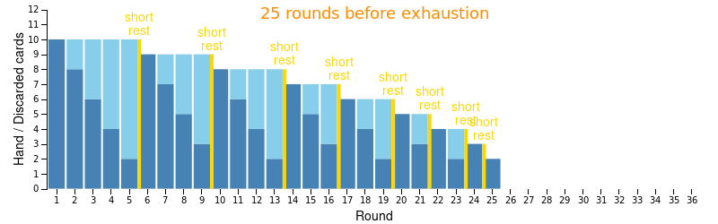
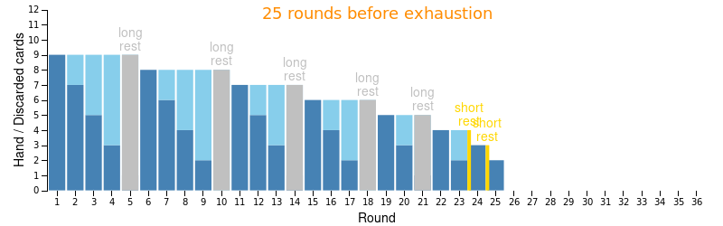
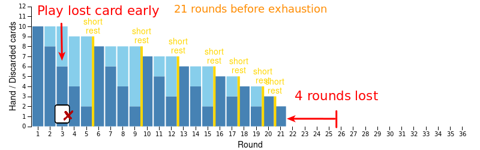
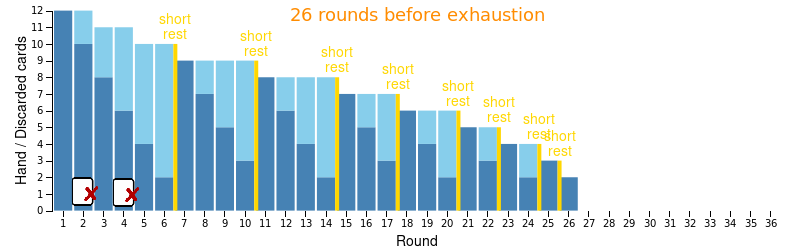
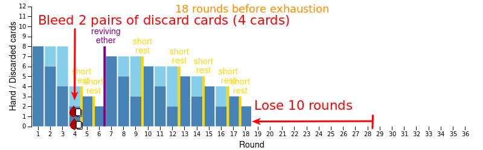

= Gloomhaven stamina and exhaustion guide
:awestruct-description: Learn how to avoid becoming exhausted with your Gloomhaven character.
:awestruct-game_id: gloomhaven
:awestruct-layout: boardGameBase

The most common way to lose a game of Gloomhaven is to run out of cards and become exhausted.
Health is less of a problem than stamina,
because you can always avoid damage by throwing away cards.

Let's take a look at the maximum number of rounds you can play before going exhausted.
For example, link:gloomhavenStaminaCalculator.html[the stamina calculator]
shows that a Brute can play a maximum of 25 active rounds:

As I 'll show, *your stamina depends a lot on your character,
how many long rests you take
and especially _when_ you play lost cards (or when you bleed any).*

Let's see how we can avoid premature exhaustion:

== Characters differ greatly in stamina

Your character's number of starting cards directly influence how fast you'll become exhausted.
For example, without playing lost cards nor taking long rests,
*a Tinkerer becomes exhausted after 36 rounds, but a Scoundrel already after 20 rounds.*

|===
|Character |Card limit |Max active rounds |Visualization

|Scoundrel |9 |20 a|image::staminaBaseScoundrel.png[link="staminaBaseScoundrel.png" role="thumbnail"]
|Brute, Mindthief |10 |25 a|image::staminaBase.png[link="staminaBase.png" role="thumbnail"]
|Cragheart |11 |30 a|image::staminaBaseCragheart.png[link="staminaBaseCragheart.png" role="thumbnail"]
|Tinkerer |12 |36 a|image::staminaBaseTinkerer.png[link="staminaBaseTinkerer.png" role="thumbnail"]
|Spellweaver |8 |28 a|image::staminaBaseSpellweaver.png[link="staminaBaseSpellweaver.png" role="thumbnail"]
|===

The Spellweaver is a special case: with her _Reviving Ether_ card she can pick up all her lost cards once.
If her timing is right, she can last 28 rounds, longer than half of the starting classes.

These character differences have some consequences:

* High stamina characters (Tinkerer, ...) play lost cards more often
** A Tinkerer that plays 2 lost card before the first rest still has more stamina than a Brute.
* Low stamina characters (Scoundrel, ...) use long rests more often
** For example, a Scoundrel can play those 25 rounds of a Brute or MindThief if she takes 5 long rests:
+

** Long rests refresh spent items, so spent items are more useful to a Scoundrel than to a Tinkerer.

Normally a scenario takes 10-15 rounds,
so even the Scoundrel's low stamina of 20 active rounds is plenty,
if you play her cards right...

== Playing lost cards early is very expensive

What's the stamina cost for playing a lost card?

Well, it depends on the timing.
To illustrate, let's presume you're playing a Brute or a Mindthief:

If you play a lost card before your first rest,
you effectively loses 4 rounds in the scenario:

On the other hand, if you play the same lost card near the end of the scenario,
you only lose 1 round (or less):

image::staminaPlayLostCardLate.png[Play lost card late]

Each lost card you play early on in the scenario costs you a lot of stamina.
The stamina cost of the first lost card reduces by 1 round for:

* every even rest, for characters that start with an even number of cards.
* every odd rest, for characters that start with an odd number of cards.

Round cost of playing the first lost card:

|===
.2+|Character 8+|Lost card before Xth rest, costs Y rounds
|1st |2nd |3th |4th |5th |6th |7th |8th

|Scoundrel |4 2+|3 2+|2 2+|1 |0
|Brute/Mindthief 2+|4 2+|3 2+|2 2+|1
|Cragheart |5 2+|4 2+|3 2+|2 |1
|Tinkerer 2+|5 2+|4 2+|3 2+|2
|Spellweaver 2+|3 2+|2 2+|1 2+|0
|===

So if you're a Scoundrel or a Cragheart,
you might wait until after the 1th or 3th rest to play a lost card.
On the other hand, if you're a Brute, Mindthief, Tinkerer or Spellweaver,
there's no point in waiting until after the 1th rest to play a lost card:
you need to wait an even number of rests.

Again, the Spellweaver is a bit special.
In her case, that higher than normal cost, occurs twice:
at the start of the scenario and after you play _Reviving Ether_.
And the cost is only 3 rounds.
Furthermore, there is a moment when playing a lost card actually increases your stamina:
it's best to combine her _Reviving Ether_ with another lost card, that is played first,
so that other card ends up back in your hand, instead of on the discard pile.

So *avoid playing your lost cards before the first few rests*,
especially if you're a low-stamina character.
On the other hand, if you're a Tinkerer and play 2 lost cards before the first rest,
you still have more stamina left than a Brute, Mindthief or a Scoundrel that didn't play any:

== Bleeding cards early is even more expensive

To avoid damage from a monster attack, you can choose to lose 1 hand card instead.
Losing a hard card actually costs more rounds than playing a lost card.
For example, a Brute loses 4 rounds if you play a lost card before the first rest.
But if you bleed a hand card before the first rest, you loose 5 rounds:

image::staminaBleedHandCardEarly.png[Bleed hand card early]

That's awful lot. *If you can survive a heavy attack in the early game,
take the damage, instead of losing a hand card.*
You can use the rounds that you don't lose to ignore attack damage 3-4 times in the late game instead.

Instead of losing 1 hand card, you can also choose to loose 2 discard cards to nullify an incoming attack.
That's even worse. For example, if our Brute needs to avoid an attack and has no hand cards left,
he'll loose 8 rounds by bleeding a pair of discard cards:

image::staminaBleedDiscardPairEarly.png[Bleed a pair of discard cards early]

Remember that the 2 cards you're playing in a round cannot be used to mitigate damage!
They're considered to be locked in.
*So be especially careful of taking too much damage in the last round(s) before your first rest*,
when you have no hand cards left: you might need to forfeit 2 discard cards and a lot of stamina to survive,
per attack.
One attack can cripple you. Two attacks can devastate you.

If the Tinkerer bleeds 2 pairs of discard cards (so 4 cards),
she loses 18 rounds and has a maximum of 18 rounds, which is still acceptable.
Ironically, the Spellweaver in the same situation only loses 10 rounds
and because her Reviving Ether works like a reset button,
she's also left with a maximum of 18 rounds:

== A minor stamina potion increases stamina by 1 round

A minor stamina potion allows you to pick up 2 _discarded_ cards once per scenario.
That effectively gives you only one extra round.
It doesn't return any lost cards, so it's no excuse to play a lost card or bleed early,
because those actions cost you far more rounds (usually 4 or 5).

The real advantage of this stamina potion is that you can pick up your _best_ 2 cards
and play them an extra time.

== The cost of premature rests doesn't change over time

If you have 0 or 1 hand cards left at the end of a round,
it's time to take a short or long rest.
But what if you rest to get your discarded cards back earlier?

The stamina cost in rounds is always the number of hand cards divided by 2 rounded down.
This calculation is the same early in the scenario as near the end (although you'll have less hand cards on average near the end).

For example, if you have 6 or 7 hand cards left at the end of a round, a rest will reduce your stamina by 3 rounds.
Remember that a Brute loses 4 rounds for playing a single lost card.
So even if you rest with half your deck in hand before the first rest,
you'll still lose less rounds than playing one lost card!

== Try it yourself

I hope you enjoyed this guide. If you want to do your own experiments,
link:gloomhavenStaminaCalculator.html[try our interactive stamina calculator.]
